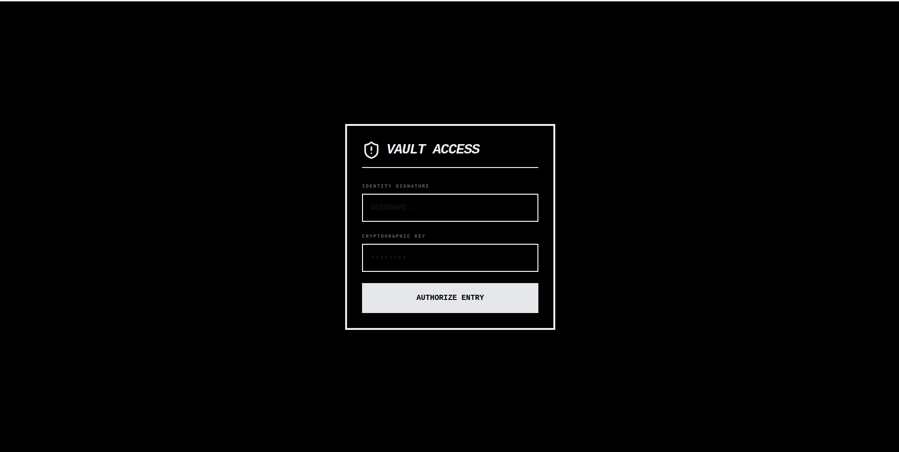
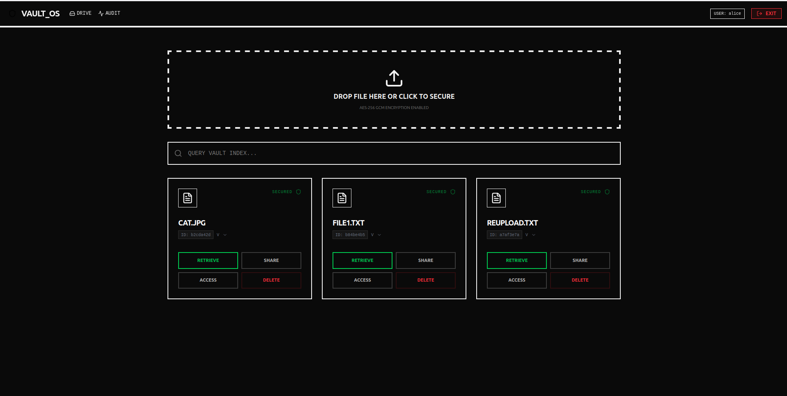
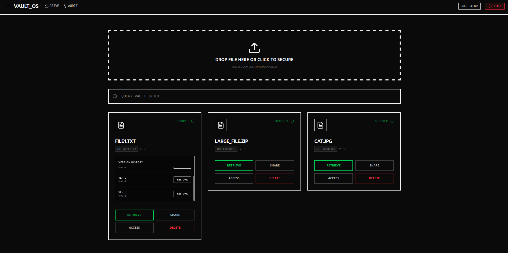
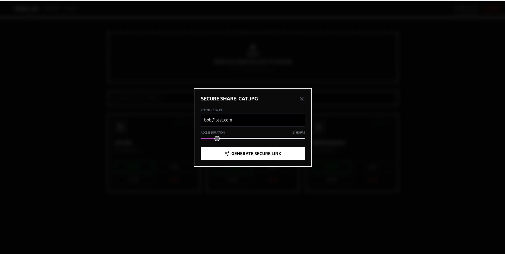
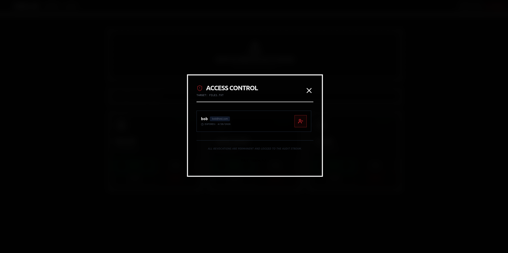
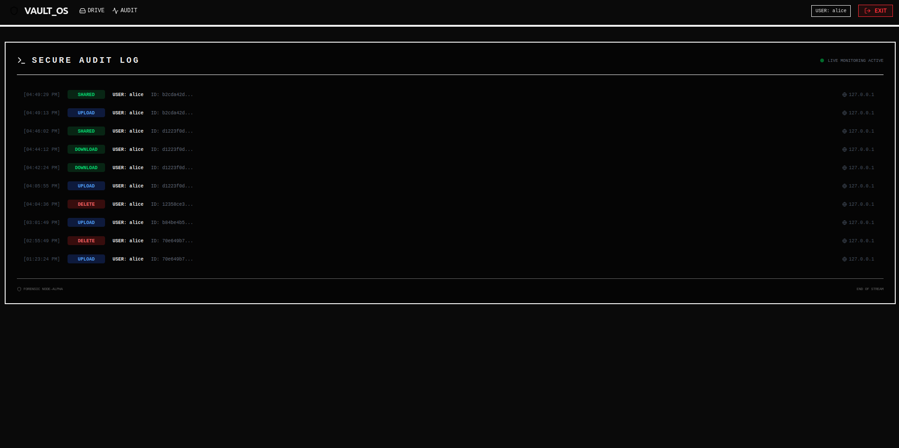
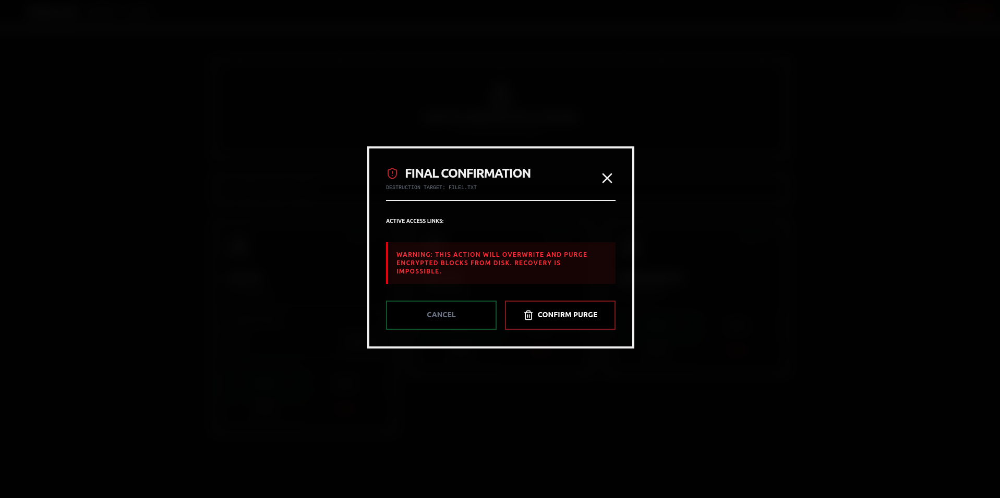
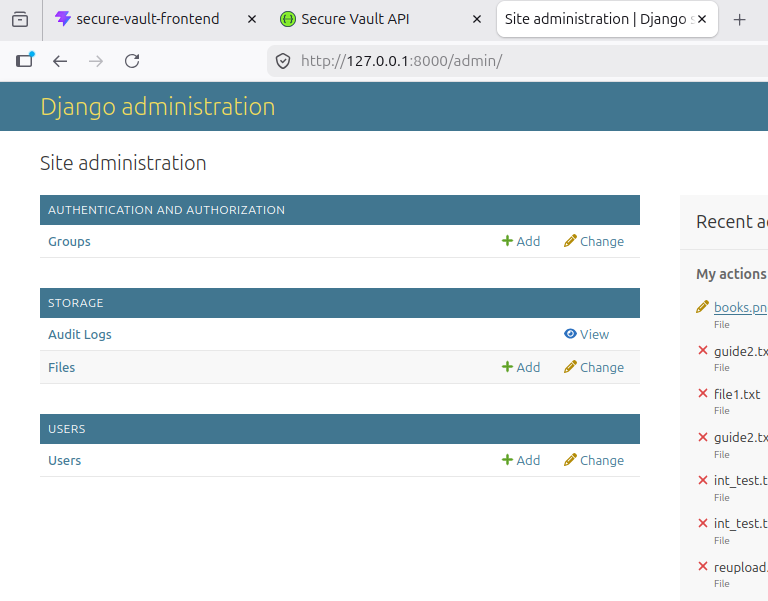

# 🔐 Secure Cloud Vault (AES-GCM Streaming)

A high-performance, secure file storage system designed to handle large-scale data (up to 2.5 GB) using **Zero-RAM-Peak Streaming Encryption**.

---

## 🚀 Core Technical Features
* **Streaming AES-256-GCM:** Files are encrypted/decrypted in 64KB chunks. The server never holds the full file in RAM, preventing OOM (Out of Memory) crashes for large 2.5GB uploads.
* **Version Control:** Every upload creates a new file version, allowing users to track changes or roll back to previous states.
* **Granular Sharing:** Secure link generation with expiration dates and revocation "kill-switches."
* **Audit Logging:** Comprehensive tracking of every upload, download, and share action for security compliance.
* **JWT Authentication:** Stateless security using JSON Web Tokens (Access & Refresh tokens). This ensures secure, session-less communication between React and Django.

---

## 📸 System Walkthrough

### 1. Security Access (Login)

*Secure JWT-based authentication with auto-refresh token logic.*

### 2. Personal Vault (Home)

*Central dashboard managing all encrypted files and storage stats.*

### 3. Version Management

*List of all historical versions for a single file, showing timestamps and sizes.*

### 4. Secure Sharing

*Collaborator access management including email-based sharing and access tokens.*

### 5. Shared With Me

*View files other users have granted you permission to access.*

### 6. Security Audit Logs

*Real-time tracking of IP addresses and user actions (Download/Upload/Share).*

### 7. Data Disposal (Delete)

*Cryptographic erasure—ensuring physical file deletion and record purging.*

### 8. Django Admin Dashboard

*General Admin dashboard used for creating users and manage everything at one place.*
---

## 🛠️ Tech Stack
* **Backend:** Django, Django REST Framework, Python `cryptography` (Hazmat layer).
* **Frontend:** React, Tailwind CSS, Axios (Streaming enabled).
* **Database:** PostgreSQL (Metadata), Local/S3 Storage (Encrypted Blobs).
* **Encryption:** AES-256-GCM with PBKDF2 Key Derivation.

---

## ⚙️ Installation & Setup
### 1. **Clone the repo:** `git clone https://github.com/MKaif07/secure_vault.git`
### 2. **Setup Backend:** 
```
# Install dependencies
pip install -r requirements.txt

# Initialize Database
python manage.py makemigrations
python manage.py migrate

# Create Admin Account (For dashboard access at /admin)
python manage.py createsuperuser

# Start Server
python manage.py runserver
```
Once the backend server is running, you can access the interactive API documentation (Swagger UI) at:
`http://localhost:8000/api/docs/`
This interface allows you to view all available endpoints, required parameters, and test API requests directly from your browser.

### 3. **Setup Frontend:** 
```
cd secure-vault-frontend
npm install && npm start
```

### 🔑 Key Management & Security Architecture

The vault employs an industry-standard **Envelope Encryption** model to ensure data remains secure even if the database is compromised.

#### 1. The Encryption Flow (Envelope Encryption)
* **DEK (Data Encryption Key):** For every file version uploaded, a unique, cryptographically strong **AES-256 key** is generated in volatile memory (RAM) using `os.urandom(32)`.
* **Key Wrapping:** This DEK is then encrypted (wrapped) using a **Master Key** (stored securely in server-side environment variables).
* **Nonce (IV):** A unique 12-byte nonce is generated for every encryption operation to ensure that even if identical files are uploaded, the resulting ciphertext is unique, preventing pattern-based attacks.
* **Storage:** Only the **Encrypted DEK** and the **Nonce** are stored in the PostgreSQL database. The plaintext DEK is never persisted.

#### 2. Why it is Secure
* **Zero-Persistence:** The raw (plaintext) DEK exists only in RAM during the streaming process and is immediately purged by the garbage collector once the stream concludes. It never touches the disk.
* **Isolation (Blast Radius):** Every version of every file has its own unique DEK. If one key were somehow compromised, it would grant no access to any other version or file in the vault.
* **Cryptographic Erasure:** When a file is deleted, its encrypted DEK is purged from the database. Without this key, the encrypted blob on the disk becomes mathematically unrecoverable "ciphertext garbage," providing a more secure deletion than standard filesystem wipes.
* **Key Rotation Support:** Because we use Envelope Encryption, we can rotate the Master Key by simply re-encrypting the small DEKs in the database, without needing to re-encrypt gigabytes of actual file data.